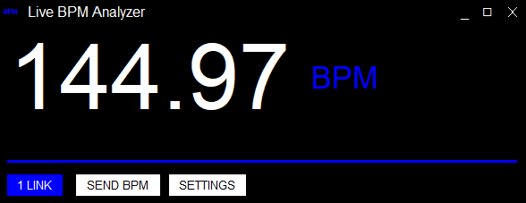

#  BpmAnalyzer Ver 2.0

 

"A BPM analyzer designed for live musicians using DAWs like Ableton or VJs who want to collaborate with other artists and focus more on performance instead of wasting time finding the right tempo of a source that cannot be digitally synced. The operating range is currently set between 110-160 BPM.

Advantages:

    - Very accurate regardless of the music genre (+/- 0.10)
    - Ableton Link is integrated, allowing connection to a wide range of VJ software, DAWs, and more.
    - MIDI mapping implementation for sending the BPM to connected programs.
    - Works with low-quality signals, such as a microphone input.

Installation:

    1. Download all files in the repository and save them in a new folder.
    2. Run BpmAnalyzer.py from the command line.
    3. For a compiled version (.exe), please contact me.
